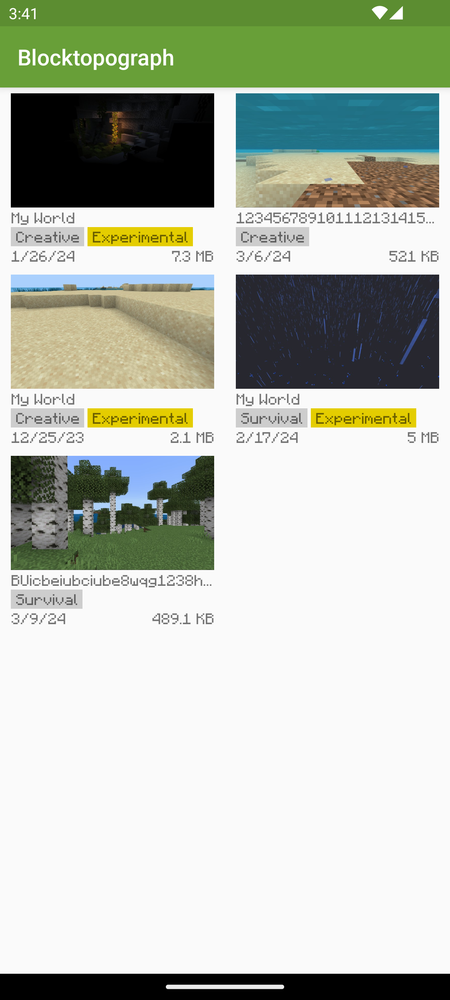

# Blocktopograph

- This fork is trying to support MCBE 1.20+ for Android 10+ (*Storage Access Framework*)
- Improve UI and more valid NBT editing ways

## Technical Support

* Android SDK Version

|    Minium     |       Target       |
|:-------------:|:------------------:|
| Oreo - 8 (26) | Tiramisu - 13 (33) |

* Minecraft World Version

| Version | Support Status |
|:-------:|:--------------:|
|  1.20+  |  *Processing*  |

## Demo (Android 13)



## Build

Clone project in Android Studio: `File -> New -> Project from Version Control -> Git`
Install missing SDK components. Android Studio would give you the auto-fix options.

Or Manual

```shell
git clone https://github.com/NguyenDuck/blocktopograph.git
cd blocktopograph
./gradlew build assembly
```

## Contributing

Always welcome! Fork the project, improve and publish!
