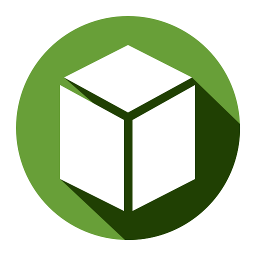

# Blocktopograph



## How this work in future?

### World Data Access
1. Use shizuku (or rooted) to access com.mojang data first
2. Copy data to "games" directory
3. Read the world data
4. Display on app

*Note: apply data back to original directory after stop the app or saved world*

### World Viewer Features
- Use libgdx to display 3D world viewer
- A NBT editor in app directly (level.dat & world data)
- Extensions system

## Build

Clone project in Android Studio: `File -> New -> Project from Version Control -> Git`
Install missing SDK components. Android Studio would give you the auto-fix options.

Or Manual
```shell
git clone https://github.com/NguyenDuck/blocktopograph.git
cd blocktopograph
./gradlew build assemble
```