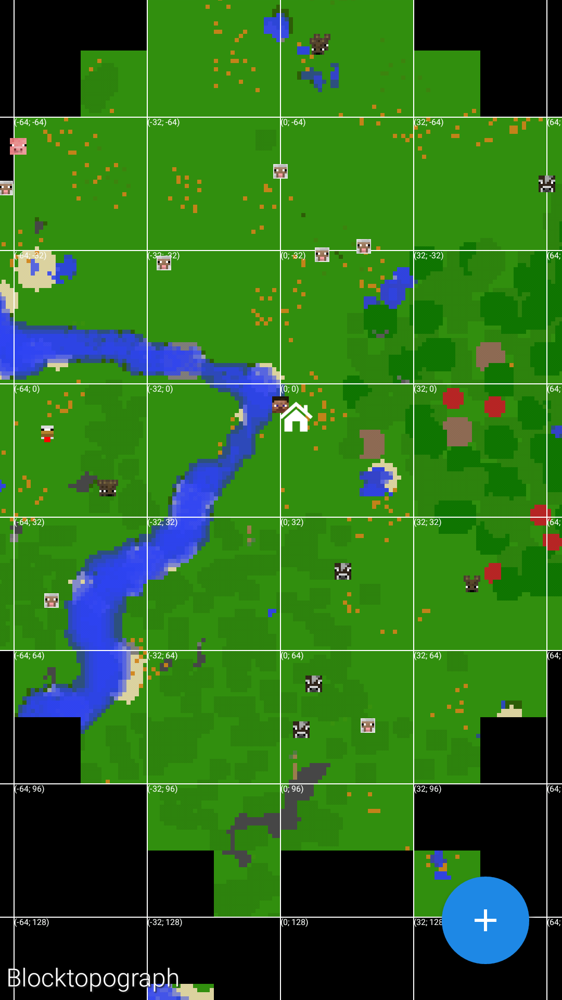

# Blocktopograph

By [@protolambda](https://github.com/protolambda), [@MithrilMania](https://github.com/MithrilMania) and
[@flagmaggot](https://github.com/flagmaggot).  
This fork is the only one supporting MCPE 1.2~1.10 for now.

## Update paused
Until next change in Minecraft level format.  
Pull requests will still be processed in time during the pause unless Meow Cat decays.  

## Download
[>>> Download on Google Play <<<](https://play.google.com/store/apps/details?id=rbq2012.blocktopograph)  
And release page of the repository provides debug version of the app.  

## Help!
Would you like to together update block and entity list?  

## Build

Clone project in Android Studio: `File -> New -> Project from Version Control -> Git`  
Install missing SDK components. Android Studio would give you the auto-fix options.  

### Release-Workflow

The official Google-Play version is managed by @mithrilmania. The Release-signing keys are not available.
You can build it as debug build or sign it with your own keys.

This Google-Play version will be updated after any significant and well-written feature additions and fixes.

Questions? You can reach [@protolambda on Twitter](https://twitter.com/protolambda)!

Issues and requests are welcome too, but please use the issue-tracker for this to keep things organized.

### Wiki

Reasonable wiki-suggestions are welcome; comments should be sufficient for most parts of this project.

## LICENSE

License: **AGPL v.3**

Direct consequences: all public distributed changes in the source-code
 are required to be disclosed, including their source-code.

*Full license can be found in the [**LICENSE**](LICENSE) file in the root folder of this repository.*

NOTE: Please retain the attribution to @protolambda, the original author
 and maintainer of the official app, and later significant contributors (See [CONTRIBUTORS.md](CONTRIBUTORS.md))
 out of respect for their work towards this software.

LICENSE-head:

    Blocktopograph -- Blocktopograph is a fan-made app for MCPE, it includes a top-down world viewer and a NBT editor.
    Copyright (C) 2016 @protolambda

    This program is free software: you can redistribute it and/or modify
    it under the terms of the GNU Affero General Public License as published by
    the Free Software Foundation, either version 3 of the License, or
    (at your option) any later version.

    This program is distributed in the hope that it will be useful,
    but WITHOUT ANY WARRANTY; without even the implied warranty of
    MERCHANTABILITY or FITNESS FOR A PARTICULAR PURPOSE.  See the
    GNU Affero General Public License for more details.

    You should have received a copy of the GNU Affero General Public License
    along with this program.  If not, see <http://www.gnu.org/licenses/>.

## Contributing

Always welcome! Fork the project, change what you want, and send back a pull request.
Good (and properly written) features will be merged into the official app by @mithrilmania.
