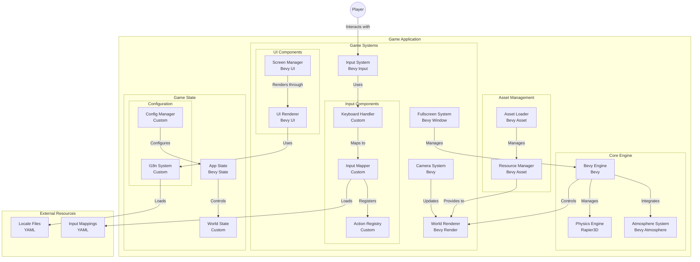

```mermaid
graph TB
    User((Player))

    subgraph "Game Application"
        subgraph "Core Engine"
            BevyEngine["Bevy Engine<br>Bevy"]
            PhysicsEngine["Physics Engine<br>Rapier3D"]
            AtmosphereRenderer["Atmosphere System<br>Bevy Atmosphere"]
        end

        subgraph "Game Systems"
            InputSystem["Input System<br>Bevy Input"]
            CameraSystem["Camera System<br>Bevy"]
            FullscreenSystem["Fullscreen System<br>Bevy Window"]
            RenderSystem["World Renderer<br>Bevy Render"]

            subgraph "Input Components"
                KeyboardHandler["Keyboard Handler<br>Custom"]
                InputMapper["Input Mapper<br>Custom"]
                ActionRegistry["Action Registry<br>Custom"]
            end

            subgraph "UI Components"
                ScreenManager["Screen Manager<br>Bevy UI"]
                UIRenderer["UI Renderer<br>Bevy UI"]
            end
        end

        subgraph "Game State"
            AppState["App State<br>Bevy State"]
            WorldState["World State<br>Custom"]

            subgraph "Configuration"
                I18nSystem["I18n System<br>Custom"]
                ConfigManager["Config Manager<br>Custom"]
            end
        end

        subgraph "Asset Management"
            AssetLoader["Asset Loader<br>Bevy Asset"]
            ResourceManager["Resource Manager<br>Bevy Asset"]
        end
    end

    subgraph "External Resources"
        LocaleFiles["Locale Files<br>YAML"]
        InputMappings["Input Mappings<br>YAML"]
    end

    %% User interactions
    User -->|Interacts with| InputSystem

    %% Core system connections
    BevyEngine -->|Manages| PhysicsEngine
    BevyEngine -->|Integrates| AtmosphereRenderer
    BevyEngine -->|Controls| RenderSystem

    %% Input system connections
    InputSystem -->|Uses| KeyboardHandler
    KeyboardHandler -->|Maps to| InputMapper
    InputMapper -->|Registers| ActionRegistry
    InputMapper -->|Loads| InputMappings

    %% Game systems connections
    CameraSystem -->|Updates| RenderSystem
    FullscreenSystem -->|Manages| BevyEngine

    %% State management
    AppState -->|Controls| WorldState
    ConfigManager -->|Configures| AppState
    I18nSystem -->|Loads| LocaleFiles

    %% UI connections
    ScreenManager -->|Renders through| UIRenderer
    UIRenderer -->|Uses| I18nSystem

    %% Asset management
    AssetLoader -->|Manages| ResourceManager
    ResourceManager -->|Provides to| RenderSystem
```
